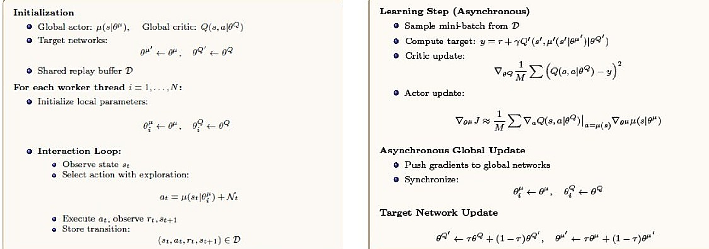
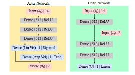

## Overview

Traditional mobile robot navigation systems, such as SLAM-based architectures, rely on building dense obstacle maps from expensive high-resolution sensors . These methods are computationally intensive and slow to update dynamically . 

This project implements an end-to-end mapless motion planner for differential-drive mobile robots using continuous Deep Reinforcement Learning . Based on **Asynchronous Deterministic Policy Gradient (ADDPG)**, the model takes a highly compressed 14-dimensional state representation—comprising 10 sparse laser range samples, 2D relative target positions in polar coordinates, and previous velocity commands—and outputs smooth continuous linear and angular velocity commands . Trained entirely within a simulated environment ( Pybullet), the learned policy directly transfers to physical robotic hardware (Kobuki-based TurtleBot) without any real-world fine-tuning . This is taken from the paper **_Virtual-to-Real Deep Reinforcement Learning: Continuous Control of Mobile Robots for Mapless Navigation_** by Tai et al.

---

## State & Action Space Formulation

The mapless navigation task is modeled as a continuous Markov Decision Process (MDP) . The input state vector $s_t \in \mathbb{R}^{14}$ is constructed at each control step by concatenating three distinct observations :

$$s_t = \begin{bmatrix} x_t & v_{t-1} & p_t \end{bmatrix}$$ 

- **Sparse Laser Readings ($x_t \in \mathbb{R}^{10}$):** 10-dimensional sparse laser range findings sampled at fixed angles between $-90^\circ$ and $+90^\circ$, normalized to $[0, 1]$ .
- **Previous Control Inputs ($v_{t-1} \in \mathbb{R}^2$):** Continuous linear and angular velocities from the preceding step $(v_{t-1}, \omega_{t-1})$ .
- **Relative Target Position ($p_t \in \mathbb{R}^2$):** Target destination represented in 2D polar coordinates (distance $r_t$ and relative heading angle $\phi_t$) with respect to the robot's local frame .

The action vector $a_t = [v_t, \omega_t]^T \in \mathbb{R}^2$ commands continuous velocities bounded by physical vehicle constraints :
- Linear Velocity: $v_t \in [0, 0.5]\text{ m/s}$ 
- Angular Velocity: $\omega_t \in [-1.0, 1.0]\text{ rad/s}$ 

---

## Continuous Control via Asynchronous DDPG (ADDPG)

To accelerate sample generation without requiring multiple parallel simulation environments, sample collection is decoupled into dedicated asynchronous background threads while maintaining a centralized off-policy replay buffer $\mathcal{D}$ .

  
  
<em>Figure 1: Asynchronous DDPG (ADDPG) training algorithm pseudocode.</em>

### Loss Formulations

The **Critic Network** $Q(s, a \mid \theta^Q)$ is trained as a regression problem: it minimizes the Mean Squared Bellman Error (MSBE) between its own prediction and a bootstrapped TD target $y_i$, built from each sampled transition's reward plus the discounted value that the *target* networks assign to the *next* state and the *next* action the target actor would take there. Using separate, slowly-tracking target networks ($\theta^{\mu'}$, $\theta^{Q'}$) to compute $y_i$ — instead of the online networks currently being updated — decouples the regression target from the parameters chasing it, which is what keeps this bootstrapped update stable rather than diverging:

$$L(\theta^Q) = \frac{1}{M} \sum_{i=1}^{M} \left( Q(s_i, a_i | \theta^Q) - y_i \right)^2$$ 

$$y_i = r_i + \gamma Q'\left(s'_{i}, \mu'(s'_{i} | \theta^{\mu'}) \middle| \theta^{Q'}\right)$$ 

The **Actor Network** $\mu(s \mid \theta^\mu)$ has no target label of its own — instead it is nudged in whatever direction makes the critic's output larger. Concretely, the critic's gradient with respect to the action, $\nabla_a Q(s,a \mid \theta^Q)$, is evaluated at the action the actor would currently take, then backpropagated through the actor's own parameters via the chain rule. This is the Deterministic Policy Gradient — a policy update that borrows the critic as a differentiable proxy for "how good was that action":

$$\nabla_{\theta^\mu} J \approx \frac{1}{M} \sum_{i=1}^{M} \left. \nabla_a Q(s, a | \theta^Q) \right|_{a=\mu(s_i)} \nabla_{\theta^\mu} \mu(s_i | \theta^\mu)$$ 

Both updates are computed off-policy from mini-batches drawn out of the shared replay buffer $\mathcal{D}$, which the $N$ asynchronous worker threads in Figure 1 keep filling concurrently. Rather than being copied outright, the target networks $\theta^{\mu'}, \theta^{Q'}$ are then nudged toward the online networks with a small soft-update rate $\tau$, so the bootstrapped targets drift slowly instead of jumping step to step.

---

## Reward Function Design

The step reward function $r(s_t, a_t)$ guides target-reaching behavior while penalizing obstacle proximity :

$$r(s_t, a_t) = \begin{cases} r_{\text{arrive}} & \text{if } d_t < c_d \text{ (Target Reached)} \\ r_{\text{collision}} & \text{if } \min(x_t) < c_o \text{ (Collision Hazard)} \\ c_r (d_{t-1} - d_t) & \text{otherwise (Progress Reward)} \end{cases}$$ 

| Hyperparameter | Description | Value |
|---|---|---|
| $r_{\text{arrive}}$ | Terminal success reward  | $+15.0$ |
| $r_{\text{collision}}$ | Terminal failure penalty  | $-15.0$ |
| $c_r$ | Distance reduction scaling multiplier  | $2.5$ |
| $c_d$ | Terminal arrival tolerance radius  | $0.25\text{ m}$ |
| $c_o$ | Minimum clearance distance threshold  | $0.15\text{ m}$ |

---

## Network Architecture & Pseudocode

The policy network processes the 14-dimensional state vector through parallel dense layers before generating bounded velocity signals .

  
  
<em>Figure 2: Network structure and layer configuration breakdown.</em>

---

## Visualizations & Demonstration Video

The trained ADDPG policy was evaluated across complex simulated arenas in  Pybullet .


Simulation Demonstration: Continuous control mapless navigation in Pybullet indoor environments.

---

## Experimental & Benchmark Results

The performance of the continuous Deep-RL agent was benchmarked against traditional map-based navigation stack components (`Move Base`) in simulated test layouts and real-world deployment evaluation :

| Planner Model | Map Required | Max Control Frequency | Execution Stability | Sim-to-Real Transfer |
|---|---|---|---|---|
| **Move Base (Full Laser)**  | Yes  | $\approx 14\text{ Hz}$  | Optimal Path  | N/A (Requires Full Map)  |
| **Move Base (10-D Sparse)**  | Yes  | $\approx 14\text{ Hz}$  | Failed at narrow corridors  | Failed (Cost-map errors)  |
| **Deep-RL (Env-1 Policy)**  | No  | $\approx 100\text{ Hz}$  | Collision-Free  | Poor Generalization  |
| **Deep-RL (Env-2 Policy)**  | **No**  | $\mathbf{\approx 100\text{ Hz}}$  | **Smooth & Highly Robust**  | **100% Zero-Shot Success**  |

### Critical Performance Metrics

- **Control Latency:** Inference time per action query is $\approx 1\text{ ms}$, achieving a **$7\times$ speedup** over traditional local trajectory planners ($\approx 14\text{ Hz}$) .
- **Sensor Reduction:** Functionally replaces dense 2D LiDAR scans with 10 discrete angular distance beams without sacrificing obstacle avoidance capabilities .
- **Emergent Behaviors:** Autonomous rotational recovery maneuvers naturally emerged from the trained policy when navigating tightly constrained passages .

---

## Key Takeaways

- Successfully developed an end-to-end mapless navigation pipeline leveraging continuous Deep-RL via Asynchronous DDPG (ADDPG) .
- Proved that an abstracted 14-dimensional state representation effectively bridges the simulation-to-reality gap without fine-tuning on real hardware .
- High inference rates ($\approx 100\text{ Hz}$) enable reactive collision avoidance under real-time execution constraints .
- Future work involves integrating Recurrent Neural Network layers (LSTM/GRU) to mitigate trajectory tortuosity caused by partial observability .
